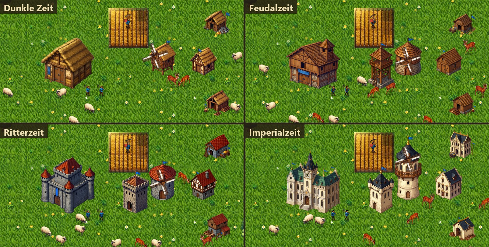

# Age of Evolutions

Ein Age-of-Empires-I-artiges Echtzeitstrategiespiel, implementiert in C# mit MonoGame unter .NET 10.


*In der Dunklen Zeit ist das Stadtzentrum ein strohgedecktes Langhaus: ein Dorfbewohner erntet das Feld,
daneben stehen Mühle, Haus, Holzfäller- und Bergbaulager; Schafe und Rehe grasen, rundherum noch Nebel.*


*Ein Kartenausschnitt, für die Aufnahme ohne Nebel: Wald, zwei Seen mit Strand, Steinbrüche, Goldadern
und Schafe auf der Wiese.*



*Dieselbe Siedlung in allen vier Zeitaltern: Gebäude und Kleidung der Dorfbewohner wechseln mit dem
Aufstieg — vom Langhaus mit Strohdach über Holzbau und Burg bis zum Rathaus aus hellem Haustein.*

## Spielstand

Spielbar ist die Wirtschaft der Dunklen Zeit und der Aufstieg durch die Zeitalter:

- Dorfbewohner sammeln Nahrung, Holz, Gold und Stein und liefern selbstständig ab
- Bauen: Haus, Mühle, Holzfällerlager, Bergbaulager, Farm, Kaserne und Palisadenmauer; ab der
  Feudalzeit Wachturm, Schießstand, Stall, Schmiede, Markt und Steinmauer; ab der Ritterzeit ein
  weiteres Stadtzentrum, Belagerungswerkstatt, Universität, Kloster und Burg; in der Imperialzeit
  das Wunder. Mauern setzt man Stück für Stück in einer Reihe. Die neuen Gebäude stehen nur -
  Einheiten, Forschung und Handel darin fehlen noch
- Ausbildung im Stadtzentrum, Bevölkerungsgrenze aus den Gebäuden
- Zeitalter: Feudal-, Ritter- und Imperialzeit, je mit Kosten und Forschungszeit; Gebäude und Dorfbewohner
  sehen in jedem Zeitalter anders aus
- Nebel des Krieges, Minimap, Zoom und Kamera; ein Klick ins Schwarze wirkt immer - die Wegsuche
  plant nur mit dem, was der Spieler schon gesehen hat
- Lebendige Landschaft: weiche Ufer und Sandstrände, Wasser mit Tiefe, Wellen, Schaum und
  Fischschwärmen; eine Wiese aus vier Grassorten - frisches, trockenes und dunkles Gras mit Klee,
  dazu Blumen in Büscheln - und Trampelpfade, wo oft jemand läuft;
  Weizen und Bäume wiegen sich in denselben Windböen
- Dorfbewohner, Schafe und Wild gehen natürlich: Schritte nach der gelaufenen Strecke, Anfahren
  und Abbremsen, gerade Wege über freies Land, Blick in Laufrichtung und zur Arbeit
- Drei Kartengrößen, im Hauptmenü wählbar: Standard (64×64), Groß (90×90), Maximal (128×128)

Kampf und eine KI für den Gegner gibt es noch nicht, siehe [TODO](TODO.md).

## Steuerung

| Eingabe | Wirkung |
|---|---|
| Rechtsklick, Rahmen mit der rechten Taste | Einheiten auswählen |
| Linksklick | Befehl: hingehen, sammeln, bauen; auf eine eigene Einheit: auswählen |
| Linke Taste gedrückt ziehen | Karte verschieben |
| Mausrad, `+` / `-` | Zoomen |
| Pfeiltasten, Bildrand | Kamera schwenken |
| Klick in die Minimap | Kamera dorthin |
| `Q` | Dorfbewohner ausbilden |
| `A` | Aufstieg ins nächste Zeitalter |
| `H` `M` `F` `B` `G` `T` | Haus, Mühle, Holzfällerlager, Bergbaulager, Farm, Wachturm |
| `K` `P` `S` `L` `E` `R` `W` | Zweite Tastenreihe: Kaserne, Palisadenmauer, Schießstand, Stall, Schmiede, Markt, Steinmauer |
| `Z` `X` `U` `O` `C` `N` | Stadtzentrum, Belagerungswerkstatt, Universität, Kloster, Burg, Wunder |
| `.` | Nächster untätiger Dorfbewohner |
| `Esc` | Pause und Menü |

Die Befehlstasten in der unteren Leiste tun dasselbe; zeigt die Maus auf eine Taste,
nennt die Leiste Name und Kosten. Bautasten gibt es nur mit ausgewähltem Dorfbewohner und
nur für Gebäude, die das Zeitalter schon freischaltet; nach einem Mauerstück bleibt der
Setzmodus an, bis man die Taste noch einmal drückt.

## Projektstruktur

- **src/AoE.Core**: MonoGame-unabhängige Spiellogik (Kampf, Wirtschaft, Zeitalter, Karte, Wegfindung)
- **AgeOfEvolutions/**: MonoGame-Spiel mit den Plattformprojekten DesktopGL und WindowsDX
- **tests/AoE.Tests**: Unit-Tests
- **demo/**: Kleine Konsolen-Testapp
- **docs/**: Dokumentation
- **tools/**: Hilfswerkzeuge — Prüfprogramme für Karte und Spielablauf, der Harness für lokale
  Ollama-Agents und `tools/bilder` für die Spielgrafik

## Zielplattformen

- **DesktopGL**: Plattformübergreifender Pfad für Windows, macOS und Linux
- **WindowsDX**: Zusätzliche reine Windows-Variante
- Android und iOS werden nicht unterstützt (die entsprechenden Projekte der MonoGame-Vorlage wurden am 2026-09-23 entfernt)

## Bauen und Starten

```bash
dotnet build AgeOfEvolutions/AgeOfEvolutions.DesktopGL/AgeOfEvolutions.DesktopGL.csproj
dotnet run --project AgeOfEvolutions/AgeOfEvolutions.DesktopGL
```

Ohne Menü direkt ins Spiel:

```bash
dotnet run --project AgeOfEvolutions/AgeOfEvolutions.DesktopGL -- --rts
```

## Tests

```bash
dotnet test tests/AoE.Tests/AoE.Tests.csproj
```

## Grafik

Programmsymbol, Menübild, Tastensymbole, Gebäude und Dorfbewohner je Zeitalter, Boden, Felder, Bäume, Stein, Gold, Schafe,
Rehe, Kaninchen und Wildschweine sind mit Qwen-Image erzeugt,
lokal über ComfyUI. Prompts, Seeds und die Werkzeuge dafür liegen in `tools/bilder`, jedes
Bild lässt sich damit genau so wieder erzeugen; Einzelheiten in der
[Projektstruktur](docs/PROJEKT_STRUKTUR.md#grafik). Gras, Sand und Wasser setzt ein Shader
(`Content/Effects/Boden.fx`) aus diesen Bildern zusammen - das Gras aus vier Sorten, die er
nach Halmhöhe ineinander blendet, der Weizen wiegt sich in
`Content/Effects/Weizen.fx`; Gehen, Wind und Fische rechnet das Spiel selbst.

## Dokumentation

- [Spielspezifikation](docs/AgeOfEmpires.md)
- [Projektstruktur](docs/PROJEKT_STRUKTUR.md)
- [TODO](TODO.md)
