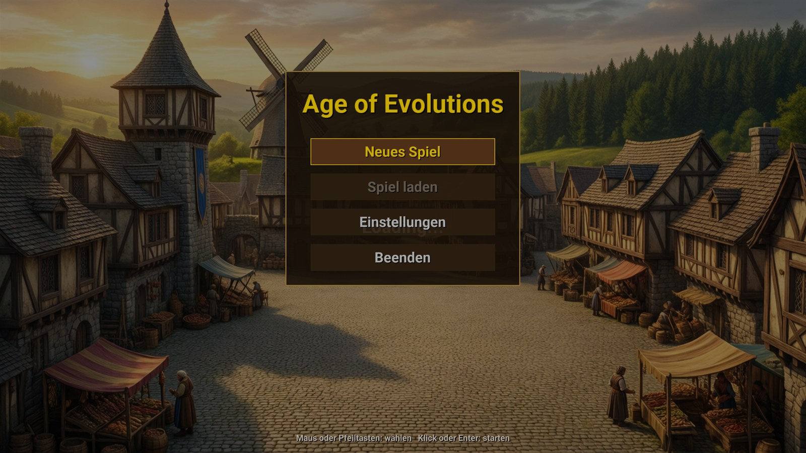
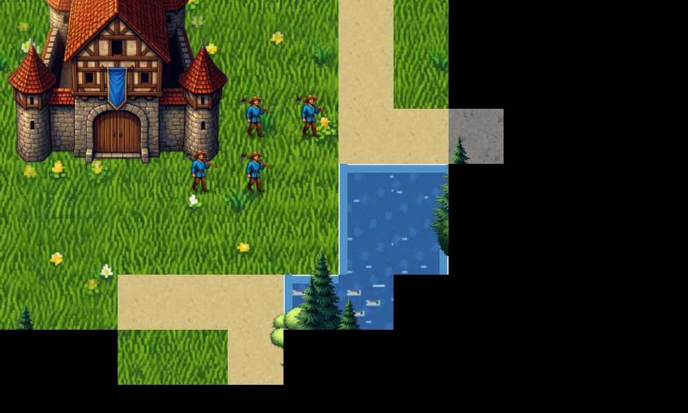
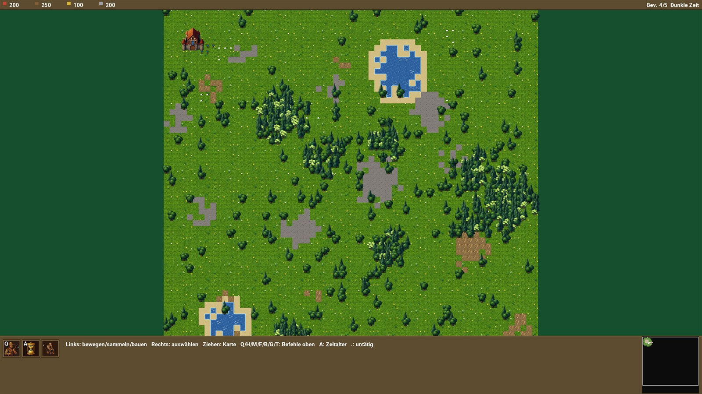

# Age of Evolutions

Ein Age-of-Empires-I-artiges Echtzeitstrategiespiel, implementiert in C# mit MonoGame unter .NET 10.





*Spielbeginn: Stadtzentrum und Dorfbewohner, rundherum noch Nebel.*



*Eine ganze Karte, für die Aufnahme ohne Nebel: Wälder, Seen, Steinbrüche, Goldminen.*

## Spielstand

Spielbar ist die Wirtschaft der Dunklen Zeit und der Aufstieg durch die Zeitalter:

- Dorfbewohner sammeln Nahrung, Holz, Gold und Stein und liefern selbstständig ab
- Bauen: Haus, Mühle, Holzfällerlager, Bergbaulager, Farm; ab der Feudalzeit der Wachturm
- Ausbildung im Stadtzentrum, Bevölkerungsgrenze aus den Gebäuden
- Zeitalter: Feudal-, Ritter- und Imperialzeit, je mit Kosten und Forschungszeit
- Nebel des Krieges, Minimap, Zoom und Kamera

Kampf und eine KI für den Gegner gibt es noch nicht, siehe [TODO](TODO.md).

## Steuerung

| Eingabe | Wirkung |
|---|---|
| Rechtsklick, Rahmen mit der rechten Taste | Einheiten auswählen |
| Linksklick | Befehl: hingehen, sammeln, bauen; auf eine eigene Einheit: auswählen |
| Linke Taste gedrückt ziehen | Karte verschieben |
| Mausrad, `+` / `-` | Zoomen |
| Pfeiltasten, Bildrand | Kamera schwenken |
| Klick in die Minimap | Kamera dorthin |
| `Q` | Dorfbewohner ausbilden |
| `A` | Aufstieg ins nächste Zeitalter |
| `H` `M` `F` `B` `G` `T` | Haus, Mühle, Holzfällerlager, Bergbaulager, Farm, Wachturm |
| `.` | Nächster untätiger Dorfbewohner |
| `Esc` | Pause und Menü |

Die Befehlstasten in der unteren Leiste tun dasselbe; zeigt die Maus auf eine Taste,
nennt die Leiste Name und Kosten.

## Projektstruktur

- **src/AoE.Core**: MonoGame-unabhängige Spiellogik (Kampf, Wirtschaft, Zeitalter, Karte, Wegfindung)
- **AgeOfEvolutions/**: MonoGame-Spiel mit den Plattformprojekten DesktopGL und WindowsDX
- **tests/AoE.Tests**: Unit-Tests
- **demo/**: Kleine Konsolen-Testapp
- **docs/**: Dokumentation
- **tools/**: Hilfswerkzeuge — Prüfprogramme für Karte und Spielablauf, der Harness für lokale
  Ollama-Agents und `tools/bilder` für die Spielgrafik

## Zielplattformen

- **DesktopGL**: Plattformübergreifender Pfad für Windows, macOS und Linux
- **WindowsDX**: Zusätzliche reine Windows-Variante
- Android und iOS werden nicht unterstützt (die entsprechenden Projekte der MonoGame-Vorlage wurden am 2026-09-23 entfernt)

## Bauen und Starten

```bash
dotnet build AgeOfEvolutions/AgeOfEvolutions.DesktopGL/AgeOfEvolutions.DesktopGL.csproj
dotnet run --project AgeOfEvolutions/AgeOfEvolutions.DesktopGL
```

Ohne Menü direkt ins Spiel:

```bash
dotnet run --project AgeOfEvolutions/AgeOfEvolutions.DesktopGL -- --rts
```

## Tests

```bash
dotnet test tests/AoE.Tests/AoE.Tests.csproj
```

## Grafik

Menübild, Tastensymbole, Gebäude, Dorfbewohner, Gras und Bäume sind mit Qwen-Image erzeugt,
lokal über ComfyUI. Prompts, Seeds und die Werkzeuge dafür liegen in `tools/bilder`, jedes
Bild lässt sich damit genau so wieder erzeugen; Einzelheiten in der
[Projektstruktur](docs/PROJEKT_STRUKTUR.md#grafik).

## Dokumentation

- [Spielspezifikation](docs/AgeOfEmpires.md)
- [Projektstruktur](docs/PROJEKT_STRUKTUR.md)
- [TODO](TODO.md)
